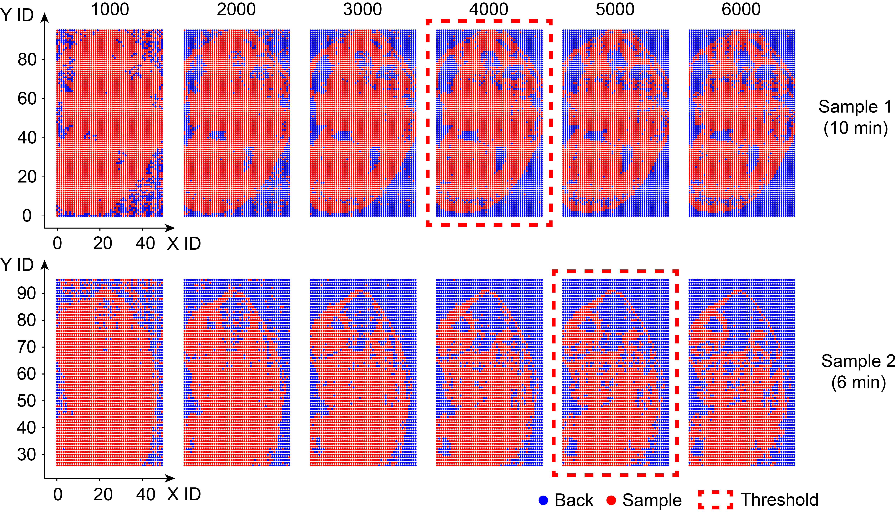
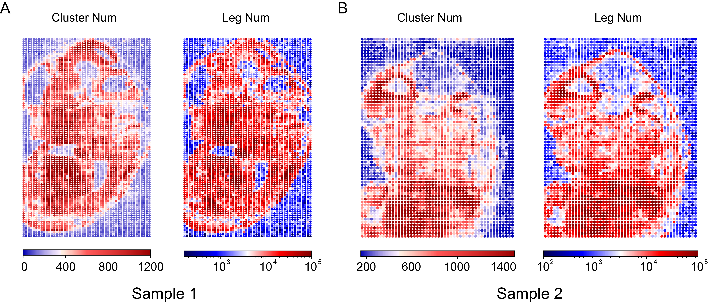
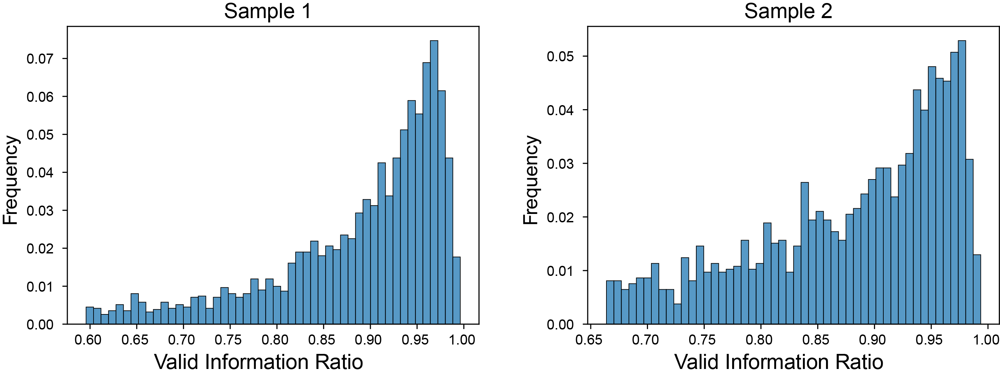

注意：本文图片源于实验结果，但添加了部分批注。

### 区分切片上的样本 spot 及背景 spot
&emsp;&emsp;我们以 spot 内 leg num 为标准，划分切片上 spot 的类型（样本区 or 背景区）。其中，背景区 spot 内的互作信息将被视为噪音而过滤掉，不纳入后续的分析中。为了确保划分地准确，我们比较了不同 leg num 作为阈值时的划分结果（图 1）与荧光结果的吻合程度。最终，样本1（超声 10min）的阈值为 leg num=4000，样本2（超声 6min）的阈值为 leg num=5000。

Fig. 1. 不同阈值下 spot 的划分结果
 
图中每个点代表一个spot，其中蓝色点代表 leg num &lt; threshold 的 spot，其被判定为背景区；红色点代表 leg num &gt; threshold 的spot，其被判定为样本区。

 

&emsp;&emsp;过滤后仍有部分非样本区 spot 的 leg num &gt; threshold，这里我们对照荧光结果进行了手动删除，详情参见 Distinguish_SampleBack.py。最终，Sample 1 切片内有 3106 个 spot 隶属于样本区，1694 个 spot 隶属于背景区；Sample 2 切片内有 1853 个 spot 隶属于样本区，1647。此外，我们还统计了两个样本各 spot 内的 cluster num 及 leg num（图 2）。

Fig. 2. 切片内各 spot 的 cluster num 及 leg num 情况
 

&emsp;&emsp;从背景区的 spot 内存在 cluster 可以推断，DNA-蛋白复合体会在不同 spot 之间扩散。为了探究扩散的程度及对 spot 内互作信息的干扰情况，我们以背景区 spot 内的互作信息为噪音，统计了样本区 spot 内有效信息的比例 ((sample-back)/sample)。具体而言，我们首先计算背景区 spot 内 leg num 的平均值，以此代表因扩散作用而产生的噪音，再计算样本区 spot 内非扩散的 leg num 的比例，然后我们将切片内所有样本区 spot 的有效信息比例以直方图的方式展示（图 3）。  

Fig. 3. 切片内样本区 spot 的有效信息比例分布
 

### SPRITE 数据预处理
#### 过滤
&emsp;&emsp;因为

