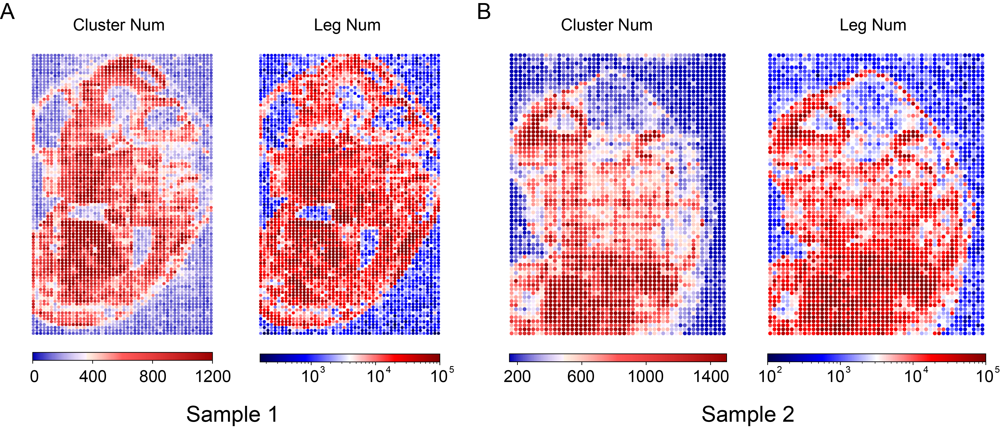

注意：本文图片源于实验结果，但添加了部分批注。

### 区分切片上的样本 spot 及背景 spot
&emsp;&emsp;我们以 spot 内 leg num 为标准，划分切片上 spot 的类型（样本区 or 背景区）。其中，背景区 spot 内的互作信息将被视为噪音而过滤掉，不纳入后续的分析中。为了确保划分地准确，我们比较了不同 leg num 作为阈值时的划分结果（图 1）与荧光结果的吻合程度。最终，样本1（超声 10min）的阈值为 leg num=4000，样本2（超声 6min）的阈值为 leg num=5000。过滤后仍有部分非样本区 spot 的 leg num &gt; threshold，这里我们对照荧光结果进行了手动删除，详情参见 Distinguish_SampleBack.py。此外，我们还统计了两个样本各 spot 内的 cluster num 及 leg num（图 2）。

 

Fig. 1. 不同阈值下 spot 的划分结果

图中每个点代表一个spot，其中蓝色点代表 leg num &lt; threshold 的 spot，其被判定为背景区；红色点代表 leg num &gt; threshold 的spot，其被判定为样本区。

 

Fig. 2. 切片内各 spot 的 cluster num 及 leg num 情况

 

### SPRITE 数据预处理
#### 过滤
&emsp;&emsp;因为

